# GymInfinity

  GymInfinity provide informative knowledge and guidance to gymmers(new bee). GymInfinity users can create their helpful notes.
### Technologies
   + React Native
   + Angular2

## Preparing your environment
* Set up React Native for iOS and/or Android following [Getting started](https://facebook.github.io/react-native/docs/getting-started.html) and [Android setup](https://facebook.github.io/react-native/docs/android-setup.htmlt)

## Basic Usage 

```markdown

  git clone https://github.com/technolabshq/GymInfinity.git
  cd GymInfinity
  npm install -g gulp react-native-cli typings
  npm install
  gulp init
    
 # Run on Device or Emulator or Simulator.
   
    gulp start.ios  
    (OR)
    gulp start.android
  
```

## Screenshot for GymInfinity Overview
##    Android  &nbsp;&nbsp;&nbsp;&nbsp;&nbsp;&nbsp;&nbsp;&nbsp;&nbsp;&nbsp;&nbsp; IOS
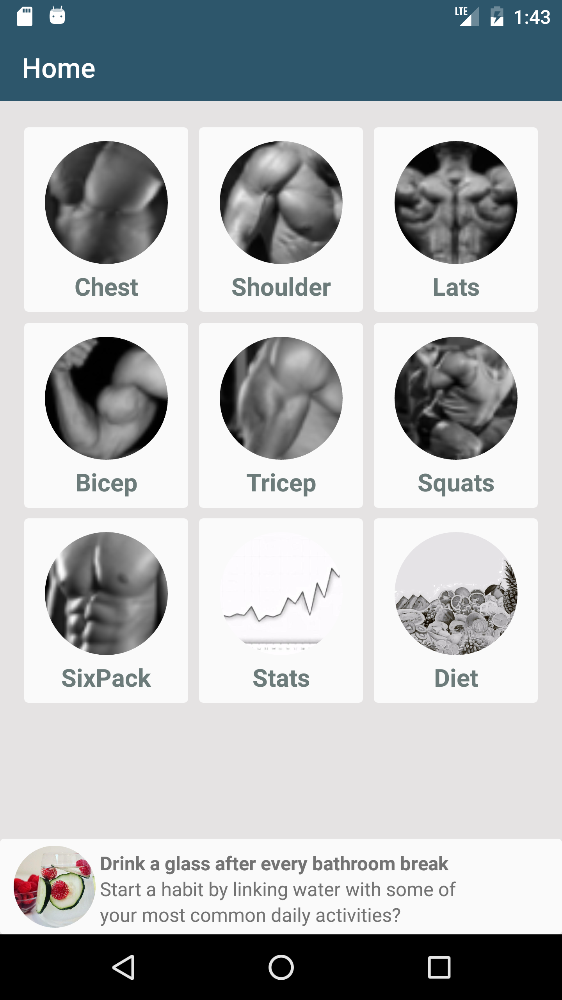 &nbsp; 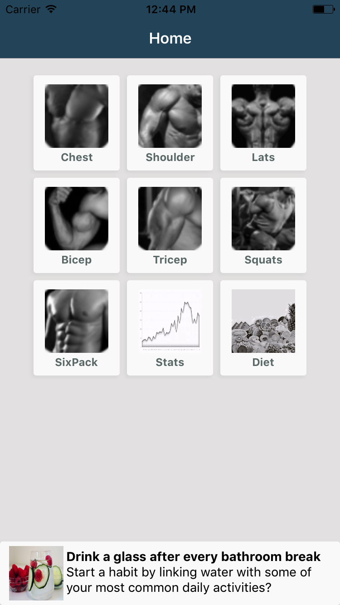

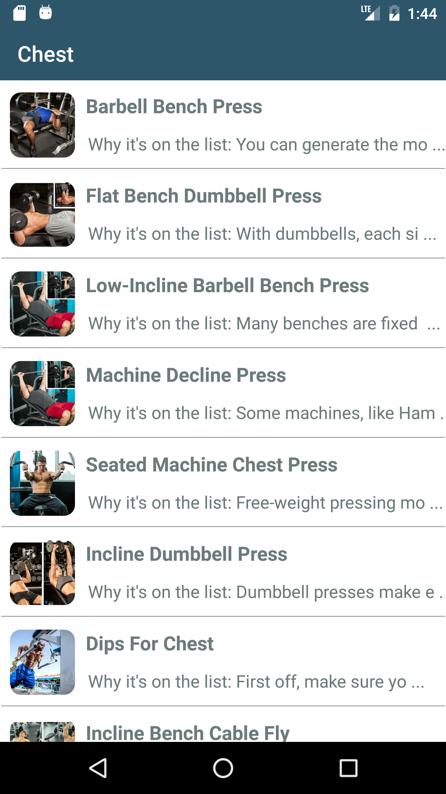 &nbsp; 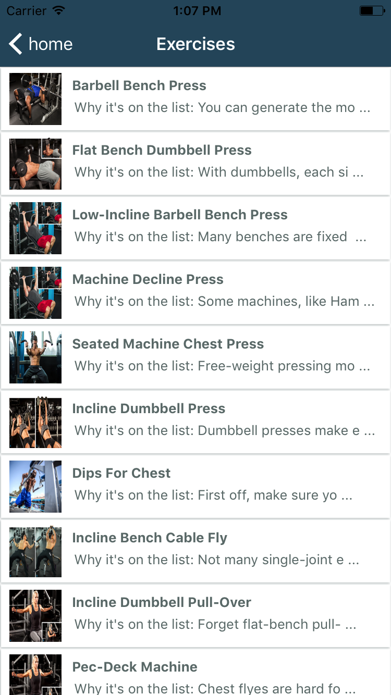

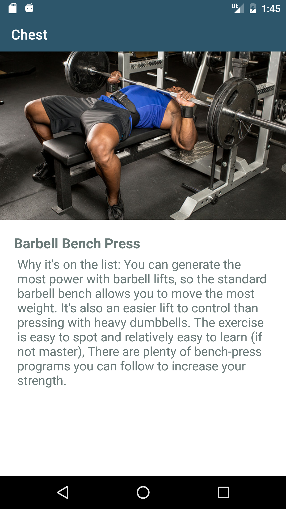 &nbsp; 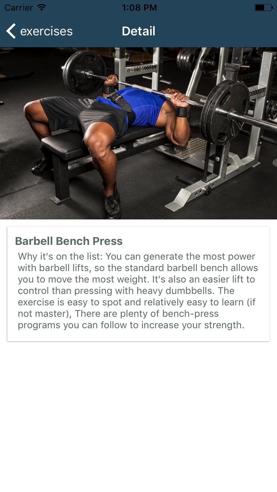

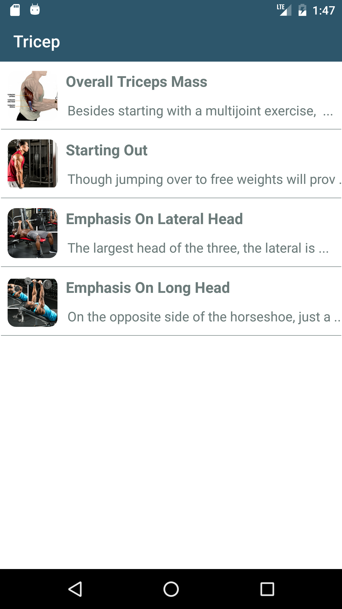 &nbsp; 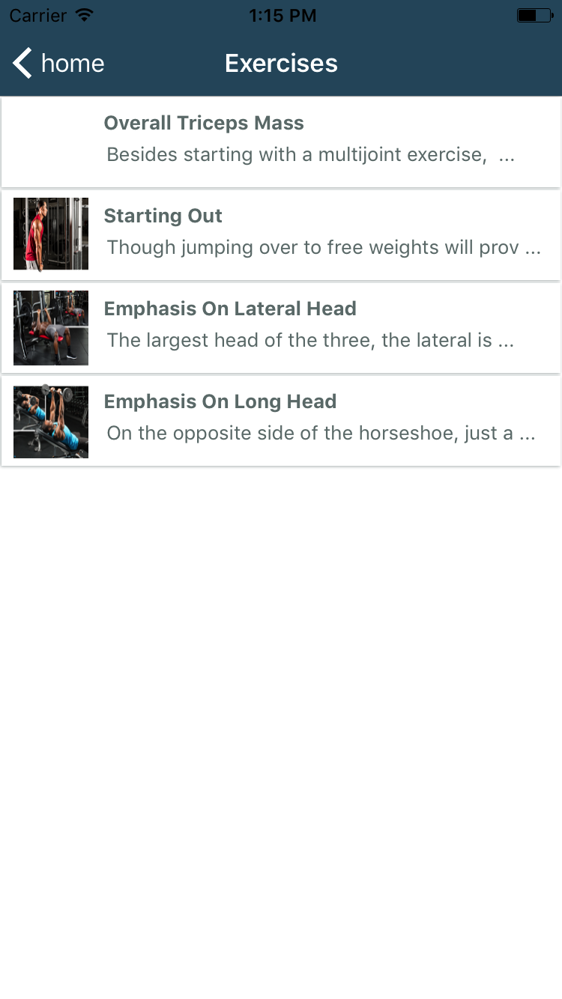

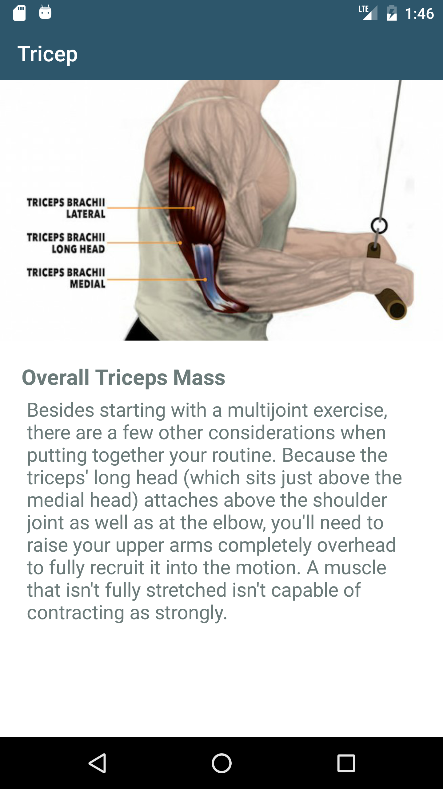 &nbsp; 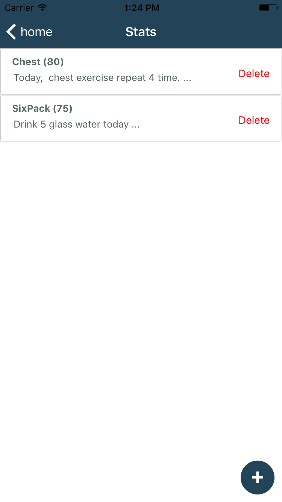

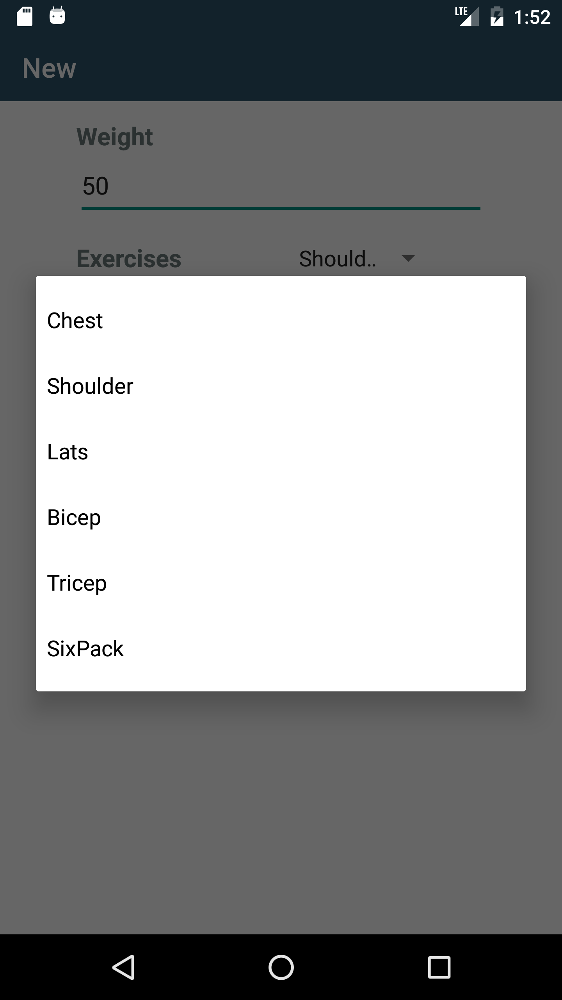 &nbsp;


For more documentation [click here react-native-renderer](http://angular.github.io/react-native-renderer)
